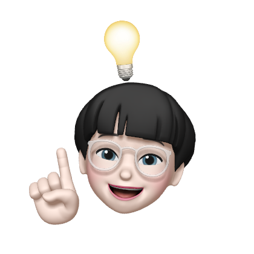
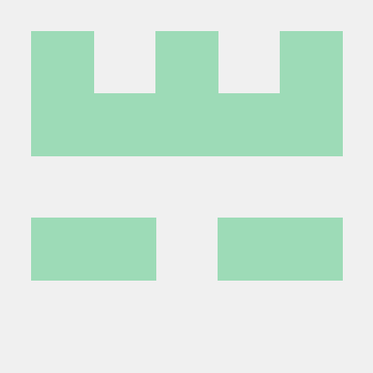
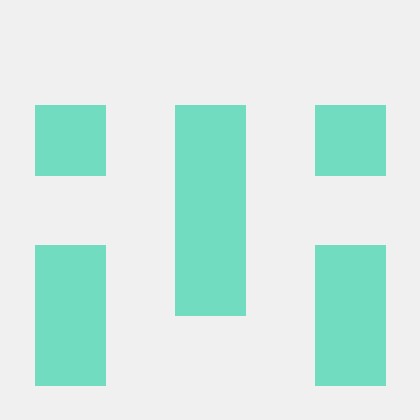

# 안녕하세요. DailyCommitSWUtudy입니다. 👋

## 스터디원 소개
<table>
  <tr>
    <td align="center">
      <a href="https://github.com/seoyeon83">
        
         
        김서연
      </a>
         
        <a href="https://github.com/DailyCommitStudy/Kims-practice-repository">Kims-practice-repository</a>
    </td>
    <td align="center">
      <a href="https://github.com/sohds">
        
         
        오서연
      </a>
         
        <a href="https://github.com/DailyCommitStudy/Ohs-practice-repository">Ohs-practice-repository</a>
    </td>
    <td align="center">
      <a href="https://github.com/BEGOODDS">
        
         
        김유빈
      </a>
         
        <a href="https://github.com/DailyCommitStudy/YB-practice-repository">YB-practice-repository</a>
    </td>
    <td align="center">
      <a href="https://github.com/Moon-ye-rin">
        
         
        문예린
      </a>
         
        <a href="https://github.com/DailyCommitStudy/Moon-practice-repository">Moon-practice-repository</a>
    </td>
  </tr>
  <tr>
    <td align="center">
      <a href="https://github.com/hyesung322">
        
         
        양혜성
      </a>
         
        <a href="https://github.com/DailyCommitStudy/Kims-practice-repository">Yangs-practice-repository</a>
    </td>
    <td align="center">
      <a href="https://github.com/cloveomr">
        
         
        엄채린
      </a>
         
        <a href="https://github.com/DailyCommitStudy/Eomc-practice-repository">Eomc-practice-repository</a>
    </td>
    <td align="center">
      <a href="https://github.com/dyoon-23">
        
         
        임다윤
      </a>
         
        <a href="https://github.com/DailyCommitStudy/Lims-practice-repository">Lims-practice-repository</a>
    </td>
    <td align="center">
      <a href="https://github.com/cAhyoung">
        
         
        조아영
      </a>
         
        <a href="https://github.com/DailyCommitStudy/Chos-practice-repository">Chos-practice-repository</a>
    </td>
  </tr>
  <tr>
    </td>
  </tr>
</table>
</td>
